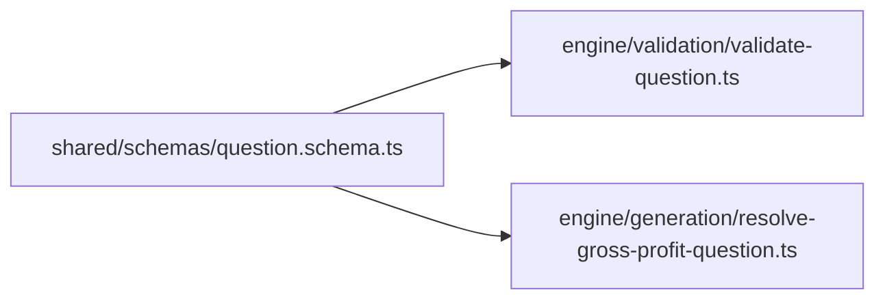

# Edu Hub Shared

The **shared** folder holds code and definitions used across the app — by the engine, API routes, and UI — without belonging to one screen or one feature alone.

```
src/shared/
├── README.md           ← this file
├── schemas/            ← data shapes and validation rules
├── types/              ← shared TypeScript types (future)
└── utils/              ← small reusable helpers (future)
```

**Think of it as:** a shared toolbox everyone can import from, so the same rules are not copied in five places.

---

## What are schemas?

A **schema** is a contract that describes what valid data looks like.

For Edu Hub, a question is not just “some JSON” — it must have specific fields (id, title, inputs, tags, etc.) with rules (minimum lengths, positive version numbers, and so on).

We define that contract in **`schemas/`** using **Zod**, a library that:

1. Describes the shape of data in code
2. Checks real data against that shape at runtime
3. Can derive TypeScript types from the same definition

Current file: `schemas/question.schema.ts`

---

## QuestionSchema — field reference

`QuestionSchema` describes one training question (including calculation-based questions).

| Field | Type / rule | Purpose |
|--------|-------------|---------|
| `questionId` | text | Unique id for this question |
| `version` | whole number, ≥ 1 | Content version of the question |
| `engineVersion` | text | Which engine build produced or supports it |
| `generationSeed` | text | Seed for reproducible generation (deterministic pipelines) |
| `hash` | text | Fingerprint for integrity / deduplication |
| `title` | text, min 3 characters | Short title shown to learners |
| `body` | text, min 10 characters | Question stem / scenario text |
| `inputs` | object: text keys → numbers | Calculation figures, e.g. `revenue`, `costOfSales` |
| `correctAnswer` | text, not empty | Expected answer (reference / marking) |
| `syllabusTags` | list of text, at least 1 tag | Syllabus labels (e.g. `F3`, topic codes) |

### Example `inputs` (calculation question)

```json
{
  "revenue": 100000,
  "costOfSales": 60000
}
```

The schema allows any string keys with number values so new calculation types can add keys without changing the schema file every time.

---

## Why Zod validation matters

Without validation, bad data can slip into the engine and produce **wrong numbers** or **crashes** that are hard to debug.

| Benefit | Plain explanation |
|---------|------------------|
| **Catch mistakes early** | Missing `costOfSales` or an empty title fails before math runs |
| **Clear errors** | Zod reports which field failed and why |
| **One source of truth** | The same rules apply whether data comes from a file, API, or test script |
| **Safer engine** | `validateQuestion()` in `src/engine/validation/` can gate data before resolvers run |

**Typical usage (elsewhere in the project):**

```ts
const result = QuestionSchema.safeParse(someData);

if (result.success) {
  // result.data is a valid Question
} else {
  // result.error explains what to fix
}
```

`safeParse` does not throw — it returns success or failure, which is beginner-friendly and easy to log.

---

## How the `Question` type is generated

In `question.schema.ts` you will see:

```ts
export const QuestionSchema = z.object({ /* fields */ });

export type Question = z.infer<typeof QuestionSchema>;
```

**What this means:**

1. **`QuestionSchema`** — the runtime validator (Zod object).
2. **`Question`** — the TypeScript type, **inferred** from that schema via `z.infer`.

So you maintain **one definition**, not a separate interface that could drift out of sync.

- In **TypeScript** (editors, compile time): use `Question` for function parameters and return types.
- At **runtime** (when data arrives): use `QuestionSchema.parse()` or `.safeParse()` to enforce the rules.

That pairing keeps Edu Hub **type-safe** and **validated** with a single source of truth.

---

## How shared connects to the engine



- **Shared** defines what a question *is*.
- **Validation** checks unknown data against that definition.
- **Generation** assumes a valid `Question` and runs the right calculation.

See also: `src/engine/README.md` for the full engine flow.

---

## What is not here yet

- UI components (see `src/components/`)
- Database access (see `src/lib/supabase.ts`)
- AI generation logic

Shared stays focused on **contracts and reusable definitions** that many layers can import.
